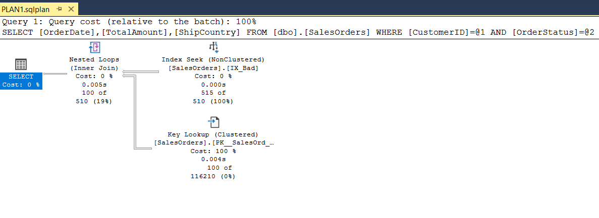
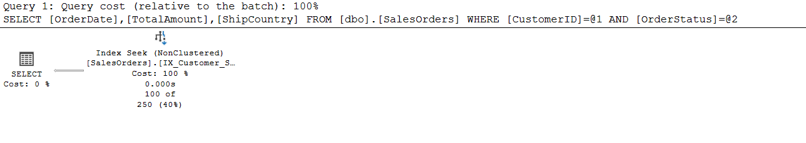
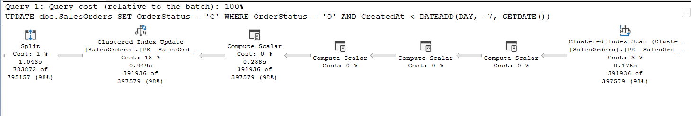
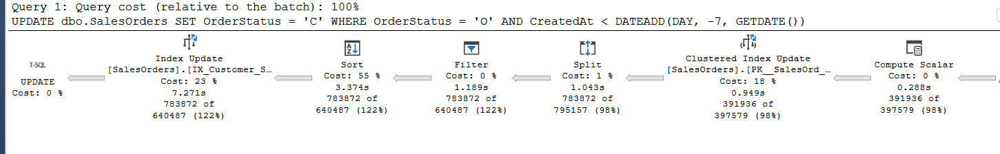
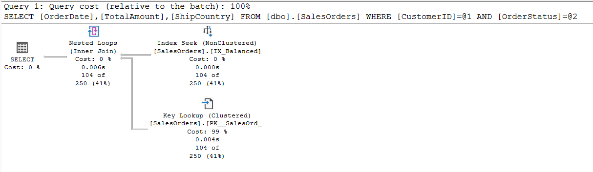
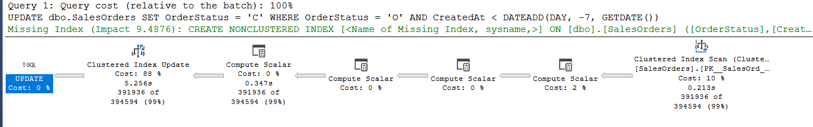

**SQL Server Indexing Trade-Offs: Covering Index vs Balanced Index**
**Overview**
This project demonstrates the impact of SQL Server indexing strategies on query performance.
It uses a synthetic dataset of 500,000 SalesOrders records to evaluate how different indexing approaches affect read performance, write cost, and overall system efficiency.

The project is divided into four stages to show a progressive analysis:

**Bad Index — Nonclustered on CustomerID only.**
**Wide Covering Index — Maximum read performance.**
**Write-heavy scenario — Observe impact of heavy writes on previous index.**
**Balanced Index — Optimized for both read and write.**
**All SQL scripts for this project are provided below.**:

[scripts](1FullRepro_CoverIndex.sql)

Table: SalesOrders
- Scripts:
 ```SQL
  -- Step 3: Drop table if exists
DROP TABLE IF EXISTS dbo.SalesOrders;
GO
-- Step 4: Create SalesOrders table
CREATE TABLE dbo.SalesOrders (
OrderID INT IDENTITY PRIMARY KEY,
CustomerID INT,
OrderDate DATE,
OrderStatus CHAR(1),
TotalAmount DECIMAL(10,2),
ShipCountry NVARCHAR(50),
CreatedAt DATETIME
);
GO

-- Step 5: Insert sample data
;WITH N AS (
    SELECT TOP (500000)
        ROW_NUMBER() OVER (ORDER BY (SELECT NULL)) AS n
    FROM master.sys.all_objects a
    CROSS JOIN master.sys.all_objects b
)
INSERT INTO dbo.SalesOrders (CustomerID, OrderDate, OrderStatus, TotalAmount, ShipCountry, CreatedAt)
SELECT
    ABS(CHECKSUM(NEWID())) % 1000 + 1,
    DATEADD(DAY, -n % 365, GETDATE()),
    CASE WHEN n % 5 = 0 THEN 'C' ELSE 'O' END,
    ABS(CHECKSUM(NEWID())) % 10000 / 1.0,
    CASE n % 4
        WHEN 0 THEN 'USA'
        WHEN 1 THEN 'Germany'
        WHEN 2 THEN 'France'
        ELSE 'Canada'
    END,
    DATEADD(MINUTE, -n, GETDATE())
FROM N;
GO

-- Step 6: Count rows
SELECT COUNT(*) FROM dbo.SalesOrders;
```

## Performance Analysis

A frequently used reporting query was tested on the SalesOrders table (500,000 rows).

## Stage 1 — Initial Index (IX_Bad)
```SQL
-- Step 7: Create initial nonclustered index (IX_Bad)
DROP INDEX IF EXISTS IX_Bad ON dbo.SalesOrders;
GO

CREATE NONCLUSTERED INDEX IX_Bad
ON dbo.SalesOrders (CustomerID);
GO

-- Step 8: Test query before optimized index
SET STATISTICS IO ON;
SET STATISTICS TIME ON;
GO
SELECT OrderDate, TotalAmount, ShipCountry
FROM dbo.SalesOrders
WHERE CustomerID = 128
AND OrderStatus = 'C';
GO
```
Query Execution Metrics:
- Execution Time: 532 ms
- Logical Reads: 1,703
- Physical Reads: 0
- Execution Plan Observations: Key Lookup present, Nested Loops join used
- Key Lookups: High
Notes: Basic index, reduces some reads but still many Key Lookups.

  
  [real_exec](plan1.sqlplan)

## Stage 2 — Wide Covering Index (Read-Optimized)

Script: 
```SQL
-- Step 9: Create covering index 
DROP INDEX IF EXISTS IX_Customer_Status_Cover ON dbo.SalesOrders;
GO

CREATE NONCLUSTERED INDEX IX_Customer_Status_Cover
ON dbo.SalesOrders (CustomerID, OrderStatus)
INCLUDE (OrderDate, TotalAmount, ShipCountry);
GO
-- Step 10: Test query after optimized index
SELECT OrderDate, TotalAmount, ShipCountry
FROM dbo.SalesOrders
WHERE CustomerID = 128
AND OrderStatus = 'C';
GO
```

Query Execution Metrics:
- Execution Time: 387 ms 
- Logical Reads: 4
- Physical Reads: 0
- Execution Plan Observations: Key Lookup and Nested Loops eliminated

Execution Plan:   [real_exec](EXEC_OPT.sqlplan)

## Stage 3 — Write-Heavy Scenario (Wide Index)

Script: 
```SQL
-- Update batch of open orders to completed
UPDATE dbo.SalesOrders
SET OrderStatus = 'C'
WHERE OrderStatus = 'O'
  AND CreatedAt < DATEADD(DAY, -7, GETDATE());
  GO
```

Observe impact of heavy writes on previous index.
Query Execution Metrics:
- Rows affected: 391,936
- Logical reads: 2,483,151
- Elapsed time: 7,781 ms
- Conclusion:Covering all required columns allows SQL Server to satisfy the query directly from the index, reducing logical reads from 1703 → 4.
- Execution Plan:    
- [real_exec](exec_hvy_ind2.sqlplan)

##**Stage 4 — Balanced Index: Optimized for both read performance and minimal write overhead**

##read test:

Script: 
```SQL
 DROP INDEX IF EXISTS IX_Balanced ON dbo.SalesOrders;
  GO

  CREATE NONCLUSTERED INDEX IX_Balanced
ON dbo.SalesOrders (CustomerID, OrderStatus)
INCLUDE (OrderDate, TotalAmount);

SELECT OrderDate, TotalAmount, ShipCountry
FROM dbo.SalesOrders
WHERE CustomerID = 128
AND OrderStatus = 'C';
GO
```

Query Execution Metrics:
- Execution Time: 434 ms (effectively negligible)
- Logical Reads: 340
- Physical Reads: 0
- Execution Plan Observations: Index scan. Key Lookup and Nested Loops eliminated
- Conclusion:The query remains efficient, but the reduced index width slightly increases read I/O — an intentional trade-off.

Execution Plan:
- [real_exec](execu_balanced_write.sqlplan)

- ### Stage 5 -Write-heavy scenario — Observe impact of heavy writes on balanced index.
- 
- Script:
- ```SQL
  UPDATE dbo.SalesOrders
   SET OrderStatus = 'C'
   WHERE OrderStatus = 'O'
  AND CreatedAt < DATEADD(DAY, -7, GETDATE());
  GO


- Query Execution Metrics:
- Rows affected: 391,936
- Logical reads: 2,372,593
- Elapsed time: 5,899 ms
- Conclusion: Compared to the wide covering index, the balanced index:
- ✅ Reduces write I/O
- ✅ Lowers elapsed time
- ✅ Improves overall system stability under write-heavy workloads
- Execution Plan: 
  - [real_exec](exec_balanced_hvy.sqlplan)

### Summary
This project highlights the real-world trade-offs of SQL Server index design:

- Poor indexing leads to excessive Key Lookups and logical reads.
- Covering indexes dramatically improve read performance.
- Wide indexes introduce significant write and maintenance overhead.
- Balanced indexes provide a practical compromise for production systems.

Key takeaway:  
**Indexing is not about making queries as fast as possible — it is about making the system performant, stable, and maintainable under real workloads.**

